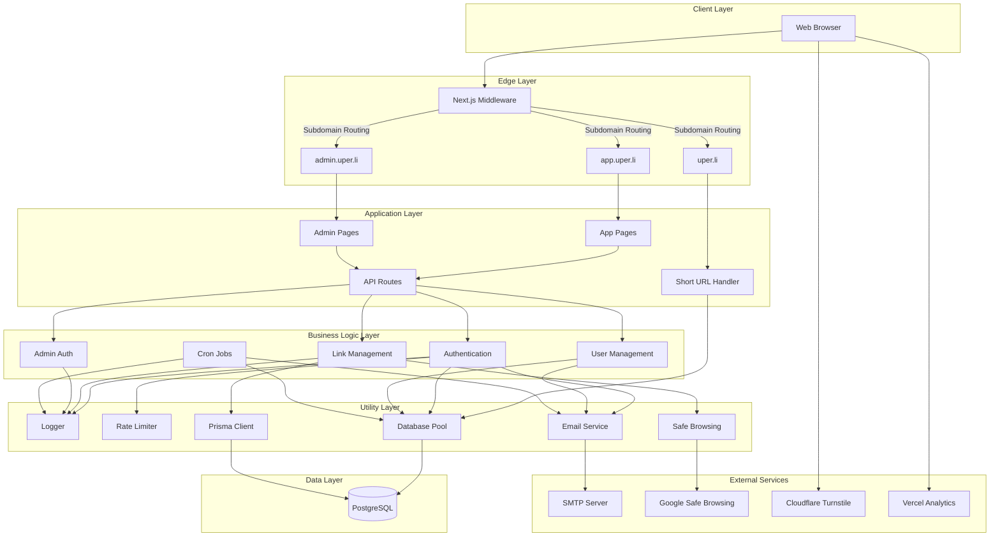
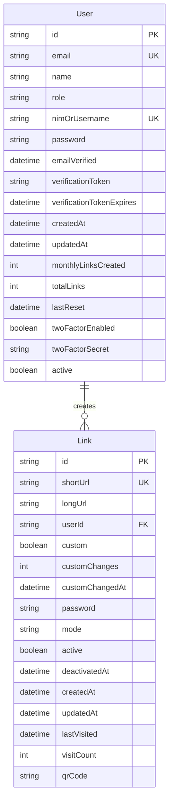
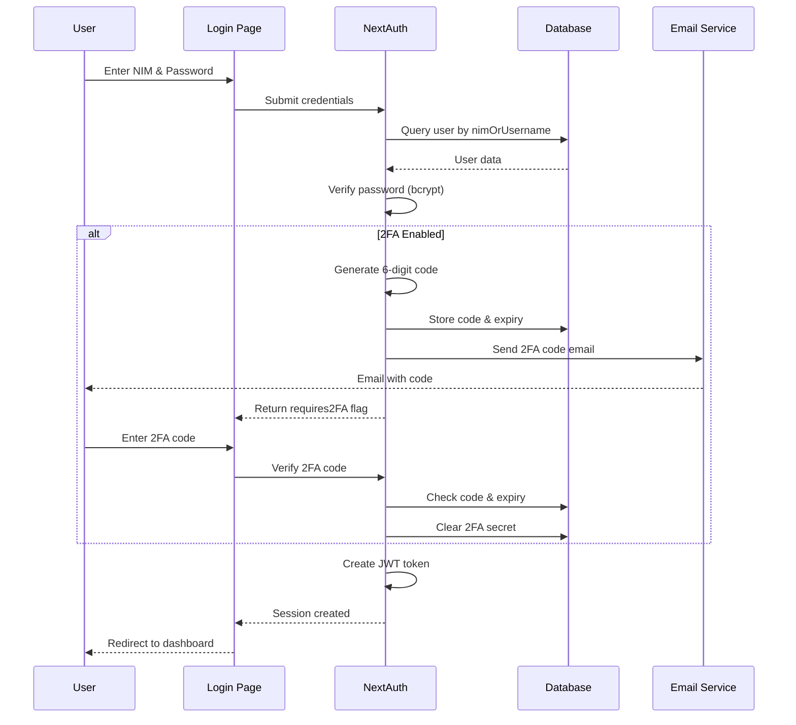
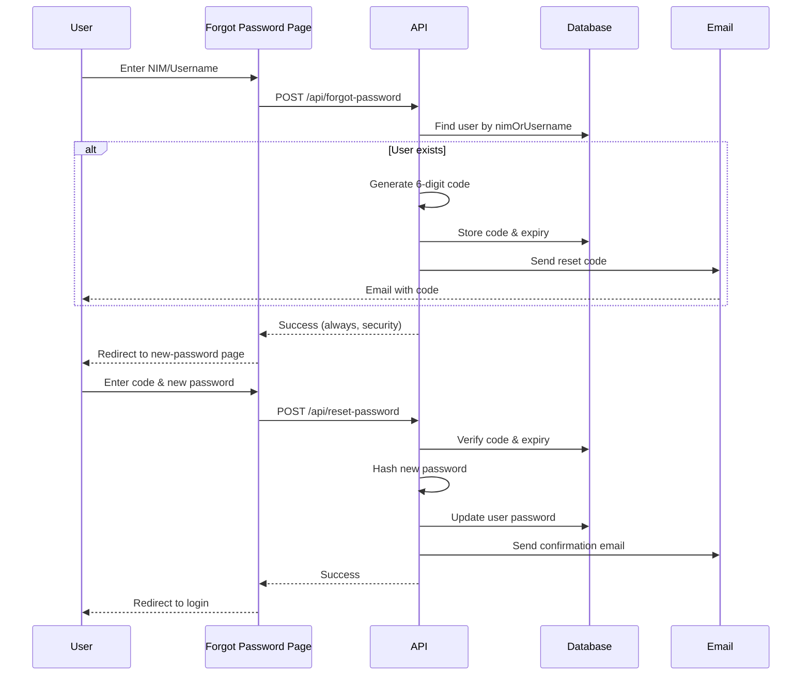
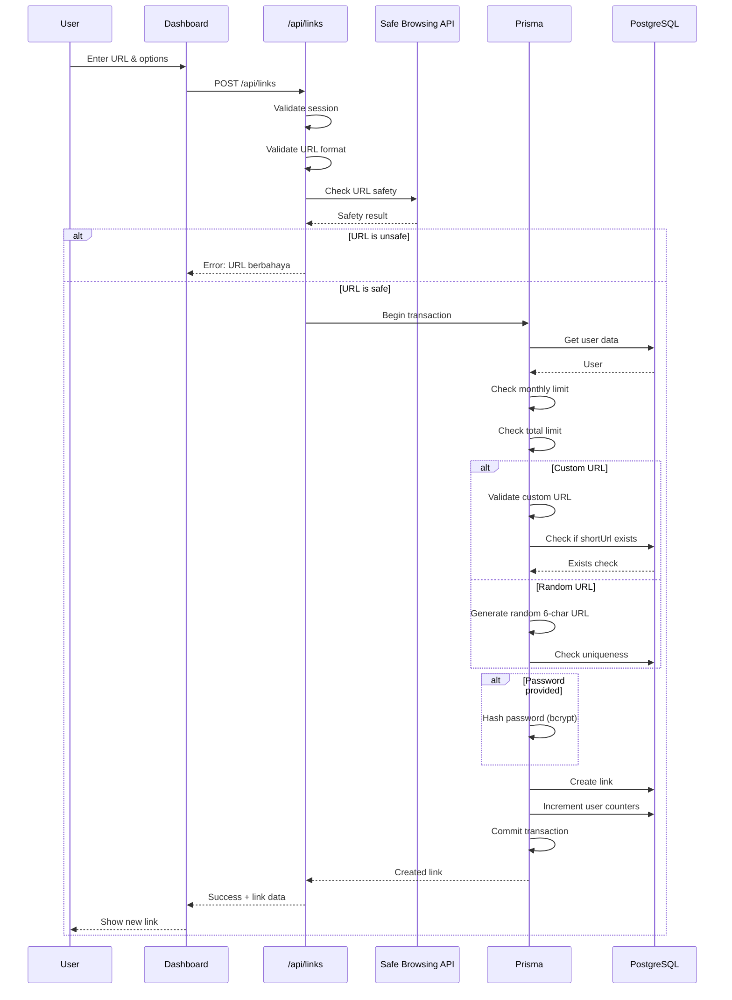
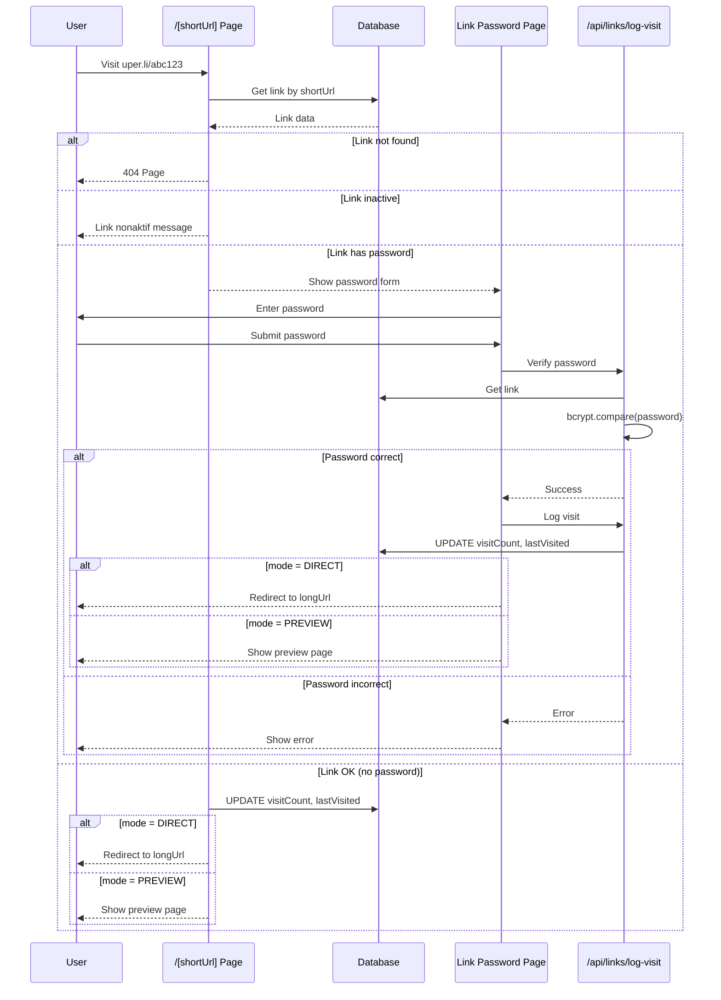
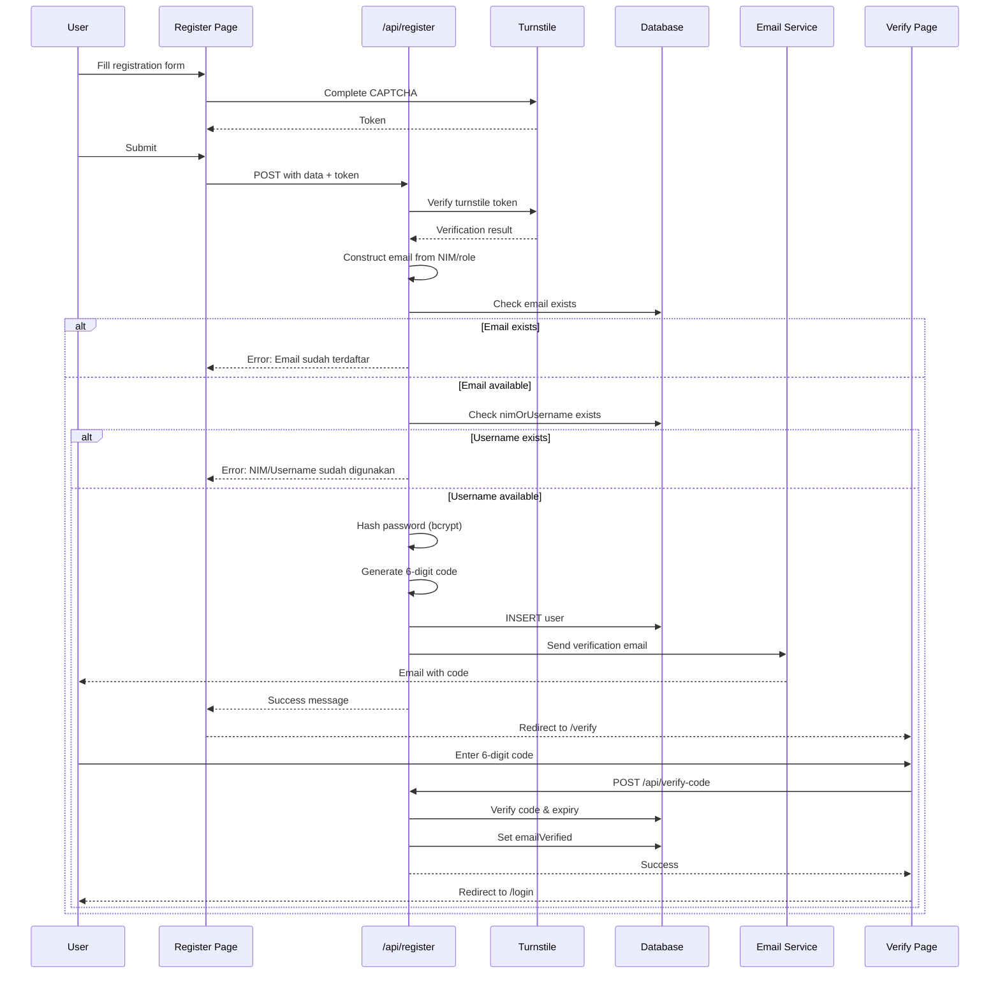

# Architecture Documentation

This document provides a comprehensive overview of the UPer.li URL shortener system architecture, designed for the Universitas Pertamina community.

## Table of Contents

- [System Overview](#system-overview)
- [Architecture Principles](#architecture-principles)
- [Technology Stack](#technology-stack)
- [System Architecture](#system-architecture)
- [Database Architecture](#database-architecture)
- [Authentication & Authorization](#authentication--authorization)
- [Routing & Middleware](#routing--middleware)
- [API Architecture](#api-architecture)
- [Component Architecture](#component-architecture)
- [Security Architecture](#security-architecture)
- [Data Flow Diagrams](#data-flow-diagrams)
- [Background Jobs (Cron)](#background-jobs-cron)
- [Email System](#email-system)
- [Logging & Monitoring](#logging--monitoring)
- [Testing Strategy](#testing-strategy)
- [Deployment Architecture](#deployment-architecture)
- [Error Handling](#error-handling)
- [Performance Considerations](#performance-considerations)

---

## System Overview

**UPer.li** is an exclusive URL shortener service designed for the Civitas Universitas Pertamina (Pertamina University community). It provides a secure, feature-rich platform for creating and managing shortened links with analytics, user management, and administrative controls.

### Target Audience
- Students (identified by NIM)
- Lecturers and Staff (identified by username)
- Administrators (system management)

### Key Features
- **User Authentication**: Secure login with email verification and optional 2FA
- **Role-Based Access**: Different limits and capabilities for STUDENT vs LECTURER/STAFF
- **Link Management**: Create, customize, edit, and manage shortened URLs
- **Password Protection**: Optional password-protected links
- **QR Code Generation**: Automatic QR code creation for all links
- **Analytics Dashboard**: Track link visits and user statistics
- **Admin Panel**: Comprehensive management interface
- **Safe Browsing**: Google Safe Browsing API integration
- **Email Notifications**: SMTP-based email system
- **CAPTCHA Protection**: Cloudflare Turnstile integration
- **Automated Cleanup**: Cron jobs for link lifecycle management

---

## Architecture Principles

### 1. Multi-Subdomain Architecture
The system uses three distinct subdomains for separation of concerns:
- `app.uper.li` - Main application for authenticated users
- `admin.uper.li` - Administrative panel
- `uper.li` - Short URL resolution and marketing homepage

### 2. Security-First Design
- All passwords hashed with bcryptjs (12 rounds)
- CAPTCHA on registration and sensitive operations
- Rate limiting on all critical endpoints
- URL safety validation before link creation
- Comprehensive security headers (CSP, HSTS, X-Frame-Options)

### 3. Separation of Concerns
- Clear separation between authentication, business logic, and data access
- Modular utility libraries for reusable functionality
- Component-based UI architecture
- API routes isolated from page rendering

### 4. Database Consistency
- Prisma ORM for type-safe database access
- Raw SQL via pg pool for complex queries
- Transactions for atomic operations
- Automatic timestamp management with @updatedAt

---

## Technology Stack

### Frontend
- **Framework**: Next.js 16 (App Router)
- **UI Library**: React 19
- **Language**: TypeScript 5
- **Styling**: Tailwind CSS 4
- **State Management**: React hooks + NextAuth session
- **Forms**: Native form handling with validation

### Backend
- **Runtime**: Node.js 18+
- **Framework**: Next.js API Routes
- **Authentication**: NextAuth.js 4 with custom adapter
- **Session Strategy**: JWT-based sessions

### Database
- **DBMS**: PostgreSQL
- **ORM**: Prisma Client
- **Direct Access**: pg (node-postgres) connection pool
- **Migration Strategy**: Prisma schema + db push

### Security & External Services
- **Password Hashing**: bcryptjs
- **CAPTCHA**: Cloudflare Turnstile
- **URL Safety**: Google Safe Browsing API v4
- **Email**: Nodemailer with SMTP
- **Analytics**: Vercel Analytics

### Development & Testing
- **Testing**: Jest 30 + React Testing Library
- **Linting**: ESLint 9 with Next.js config
- **Git Hooks**: Husky + lint-staged
- **CI/CD**: GitHub Actions

### Deployment
- **Platform**: Vercel (optimized)
- **Environment**: Production + Preview branches

---

## System Architecture



---

## Database Architecture

### Schema Overview

The database consists of two primary models: **User** and **Link**.



### User Model

**Purpose**: Stores user account information and tracks link usage limits.

| Field | Type | Description |
|-------|------|-------------|
| `id` | String (UUID) | Primary key, auto-generated |
| `email` | String (unique) | Constructed from NIM/username + domain |
| `name` | String (nullable) | User's display name |
| `role` | String | "STUDENT" or "LECTURER/STAFF" |
| `nimOrUsername` | String (unique) | NIM for students, username for staff |
| `password` | String (nullable) | bcrypt hashed password |
| `emailVerified` | DateTime (nullable) | Email verification timestamp |
| `verificationToken` | String (nullable) | 6-digit verification code |
| `verificationTokenExpires` | DateTime (nullable) | Token expiration time |
| `createdAt` | DateTime | Account creation timestamp |
| `updatedAt` | DateTime | Auto-updated on changes |
| `monthlyLinksCreated` | Int | Current month's link count |
| `totalLinks` | Int | Lifetime link count |
| `lastReset` | DateTime | Last monthly reset timestamp |
| `twoFactorEnabled` | Boolean | 2FA status |
| `twoFactorSecret` | String (nullable) | Temporary 2FA code |
| `active` | Boolean | Account active status |

**Indexes**:
- `idx_user_email` on `email`
- `idx_user_nimorusername` on `nimOrUsername`

**Constraints**:
- Email domains restricted by role (student.universitaspertamina.ac.id or universitaspertamina.ac.id)

### Link Model

**Purpose**: Stores shortened URL mappings and metadata.

| Field | Type | Description |
|-------|------|-------------|
| `id` | String (UUID) | Primary key, auto-generated |
| `shortUrl` | String (unique) | The short URL slug |
| `longUrl` | String | Original destination URL |
| `userId` | String (FK) | Link creator (references User.id) |
| `custom` | Boolean | Whether URL was customized |
| `customChanges` | Int | Number of custom URL changes |
| `customChangedAt` | DateTime (nullable) | Last custom change timestamp |
| `password` | String (nullable) | bcrypt hashed password for protected links |
| `mode` | String | "PREVIEW" or "DIRECT" (redirect mode) |
| `active` | Boolean | Link active status |
| `deactivatedAt` | DateTime (nullable) | Deactivation timestamp |
| `createdAt` | DateTime | Link creation timestamp |
| `updatedAt` | DateTime | Auto-updated on changes |
| `lastVisited` | DateTime (nullable) | Last visit timestamp |
| `visitCount` | Int | Total visit counter |
| `qrCode` | String (nullable) | QR code data URL |

**Indexes**:
- `idx_link_shorturl` on `shortUrl`
- `idx_link_userid` on `userId`

**Constraints**:
- Cascade delete: When a user is deleted, all their links are deleted
- Check constraint: shortUrl cannot match reserved paths

### Database Access Patterns

The system uses a **dual database access pattern**:

1. **Prisma Client**: Type-safe ORM for standard CRUD operations
   - Link creation with transactions
   - User profile updates
   - Link updates and deletions

2. **pg Pool**: Direct PostgreSQL access for complex queries
   - Authentication queries
   - Paginated list queries with dynamic filters
   - Admin panel statistics
   - Cron job batch operations

**Connection Pooling Configuration**:
```typescript
{
  max: 20,                      // Maximum connections
  idleTimeoutMillis: 30000,     // Close idle after 30s
  connectionTimeoutMillis: 2000 // Error after 2s if unavailable
}
```

---

## Authentication & Authorization

### NextAuth.js Implementation

The system uses NextAuth.js with a **Credentials Provider** for authentication.



### Session Strategy

**Type**: JWT-based sessions (no session database table)

**JWT Payload**:
- `sub`: User ID
- `role`: User role (STUDENT/LECTURER/STAFF)
- `nimOrUsername`: User identifier
- `requires2FA`: 2FA verification status

**Session Object** (available in components):
```typescript
{
  user: {
    id: string
    email: string
    name: string
    role: string
    nimOrUsername: string
    requires2FA?: boolean
  }
}
```

### Two-Factor Authentication (2FA)

**Flow**:
1. User enables 2FA from account settings
2. On login, if 2FA is enabled:
   - Generate 6-digit code
   - Store code in `twoFactorSecret` with 10-minute expiry
   - Send code via email
   - User must verify code to complete login
3. After verification, clear `twoFactorSecret`

**Endpoints**:
- `POST /api/2fa/setup` - Request 2FA setup code
- `POST /api/2fa/verify` - Enable 2FA with code
- `POST /api/2fa/verify-login` - Verify code during login
- `POST /api/2fa/disable` - Disable 2FA

### Email Verification

**Registration Flow**:
1. User submits registration with CAPTCHA
2. System generates 6-digit verification code
3. Code stored in `verificationToken` with 10-minute expiry
4. Email sent to constructed address (NIM@student.universitaspertamina.ac.id)
5. User verifies via `/verify` page
6. `emailVerified` timestamp set on success

### Password Reset Flow



### Admin Authentication

**Separate System**: Admin authentication uses a custom token-based system (not NextAuth).

**Implementation**:
- Admin passcode stored in `ADMIN_PASSCODE` environment variable
- HMAC-SHA256 signature for token generation
- Token format: `{base64_payload}.{signature}`
- Stored in `admin_auth` HTTP-only cookie
- Verified on each admin request

**Endpoints**:
- `POST /api/admin/login` - Admin login
- `POST /api/admin/logout` - Admin logout

### Role-Based Access Control

| Feature | STUDENT | LECTURER/STAFF |
|---------|---------|----------------|
| Monthly link limit | 5 | 10 |
| Total link limit | 100 | 200 |
| Dashboard access | ✓ | ✓ |
| Admin access | ✗ | ✗ |

---

## Routing & Middleware

### Subdomain Routing Strategy

The [middleware.ts](../src/middleware.ts) handles routing based on hostname:

```mermaid
graph TD
    Start[Request] --> CheckHost{hostname?}
    
    CheckHost -->|app.uper.li| AppSubdomain[App Subdomain]
    CheckHost -->|admin.uper.li| AdminSubdomain[Admin Subdomain]
    CheckHost -->|uper.li| MainDomain[Main Domain]
    CheckHost -->|localhost| LocalDev[Local Development]
    
    AppSubdomain --> CheckAuth{Auth page?}
    CheckAuth -->|Yes + Authenticated| RedirectDash[Redirect to /dashboard]
    CheckAuth -->|Yes + Not Authenticated| AllowPage[Allow page]
    CheckAuth -->|No| AllowPage
    
    AdminSubdomain --> RewriteAdmin[Rewrite to /admin/*]
    
    MainDomain --> CheckPath{pathname?}
    CheckPath -->|/| RedirectApp[Redirect to app.uper.li]
    CheckPath -->|/login-admin| RedirectAdminLogin[Redirect to admin.uper.li]
    CheckPath -->|/admin/*| RedirectAdminPath[Redirect to admin.uper.li]
    CheckPath -->|App routes| RedirectAppPath[Redirect to app.uper.li]
    CheckPath -->|/[shortUrl]| AllowShortURL[Allow short URL]
    
    LocalDev --> CheckAuthLocal{Auth page?}
    CheckAuthLocal -->|Yes + Authenticated| RedirectDashLocal[Redirect to /dashboard]
    CheckAuthLocal --> AllowLocal[Allow all routes]
```

### Protected Routes

**Auth Page Blocking**: Authenticated users are automatically redirected from:
- `/login`
- `/register`
- `/forgot-password`

**Protected Pages** (require authentication):
- `/dashboard`
- `/dashboard/account`

**Admin Pages** (require admin token):
- `/admin`
- `/admin/users`
- `/admin/links`
- `/admin/reports`

### HTTPS Enforcement

In production, middleware enforces HTTPS:
```typescript
if (process.env.NODE_ENV === 'production' && hostname !== 'localhost') {
  const forwardedProto = request.headers.get('x-forwarded-proto')
  if (forwardedProto === 'http') {
    return NextResponse.redirect(`https://${hostname}${pathname}`)
  }
}
```

---

## API Architecture

### Endpoint Structure

All API routes follow RESTful conventions and are organized by feature:

```
/api
├── auth/
│   └── [...nextauth]/route.ts      # NextAuth endpoints
├── 2fa/
│   ├── setup/route.ts              # Request 2FA setup
│   ├── verify/route.ts             # Enable 2FA
│   ├── verify-login/route.ts       # Verify 2FA on login
│   └── disable/route.ts            # Disable 2FA
├── links/
│   ├── route.ts                    # GET (list), POST (create)
│   ├── [id]/route.ts               # PUT (update), DELETE
│   ├── log-visit/route.ts          # POST (track visit)
│   └── public/[shortUrl]/route.ts  # GET (public link data)
├── user/
│   ├── profile/route.ts            # GET, PUT
│   ├── stats/route.ts              # GET
│   └── change-password/route.ts    # POST
├── admin/
│   ├── login/route.ts              # POST
│   ├── logout/route.ts             # POST
│   ├── users/
│   │   ├── route.ts                # GET (list)
│   │   └── [id]/route.ts           # GET, PUT, DELETE
│   ├── links/
│   │   ├── route.ts                # GET (list)
│   │   └── [id]/route.ts           # DELETE
│   └── cron/route.ts               # POST (manual trigger)
├── register/route.ts               # POST
├── verify-code/route.ts            # POST
├── forgot-password/route.ts        # POST
├── reset-password/route.ts         # POST
└── verify-link-password/route.ts   # POST
```

### Rate Limiting

All sensitive endpoints are protected with rate limiting via `withRateLimit` HOC:

| Endpoint | Limit | Window |
|----------|-------|--------|
| `/api/register` | 3 requests | 30 minutes |
| `/api/2fa/verify` | 5 requests | 10 minutes |
| `/api/2fa/verify-login` | 5 requests | 10 minutes |
| `/api/forgot-password` | 5 requests | 15 minutes |
| `/api/reset-password` | 5 requests | 15 minutes |
| Default (other endpoints) | 5 requests | 15 minutes |

**Implementation**: In-memory Map with IP-based tracking and automatic cleanup.

### Authentication Middleware

Most API routes require authentication via `getServerSession(authOptions)`:

```typescript
const session = await getServerSession(authOptions)
if (!session?.user?.id) {
  return NextResponse.json({ error: 'Unauthorized' }, { status: 401 })
}
```

### Response Patterns

**Success Response**:
```typescript
return NextResponse.json({ 
  ...data 
})
```

**Error Response**:
```typescript
return NextResponse.json({ 
  error: 'Error message in Indonesian' 
}, { 
  status: 400 | 401 | 403 | 404 | 500 
})
```

**Paginated Response**:
```typescript
return NextResponse.json({
  items: [...],
  pagination: {
    page: number,
    limit: number,
    total: number,
    totalPages: number,
    hasNext: boolean,
    hasPrev: boolean
  }
})
```

---

## Component Architecture

### Server vs Client Components

The application leverages Next.js App Router's React Server Components:

**Server Components** (default):
- All page.tsx files that don't require interactivity
- Layout components
- Data fetching at page level

**Client Components** ('use client'):
- Interactive forms and modals
- Dashboard with state management
- Components using hooks (useState, useEffect)
- Components using NextAuth's useSession

### Component Organization

```
src/components/
├── ui/                          # Reusable UI primitives
│   ├── Button.tsx
│   ├── Card.tsx
│   └── Input.tsx
├── AnalyticsContent.tsx         # Analytics display
├── DashboardNav.tsx             # Dashboard navigation
├── Footer.tsx                   # Site footer
├── LinkItem.tsx                 # Individual link card
├── LogoutButton.tsx             # Logout with modal
├── ManualCronJobs.tsx           # Admin cron controls
├── ShortUrlActions.tsx          # Short URL page actions
├── TimeZoneDisplay.tsx          # Current time display
└── providers.tsx                # NextAuth SessionProvider
```

### Key Component Patterns

**Portal-based Modals**: Critical modals use `createPortal` to render at document body level:
```typescript
createPortal(
  <ModalContent />,
  document.body
)
```

Used in:
- Edit link modal
- Delete confirmation modal
- QR code modal
- Logout confirmation

**Theme Provider**: Application supports dark mode via context:
```typescript
<ThemeProvider>
  {children}
</ThemeProvider>
```

**Session Provider**: NextAuth session available app-wide:
```typescript
<SessionProvider>
  {children}
</SessionProvider>
```

---

## Security Architecture

### Password Security

**Hashing**: bcryptjs with 12 salt rounds
```typescript
const hashedPassword = await bcrypt.hash(password, 12)
```

**Verification**:
```typescript
const isValid = await bcrypt.compare(password, user.password)
```

### CAPTCHA Integration

**Cloudflare Turnstile** on:
- User registration
- Admin login
- Other sensitive forms

**Client-side**:
```typescript
import { Turnstile } from '@marsidev/react-turnstile'

<Turnstile siteKey={process.env.NEXT_PUBLIC_CLOUDFLARE_TURNSTILE_SITE_KEY} />
```

**Server-side verification**:
```typescript
const response = await fetch('https://challenges.cloudflare.com/turnstile/v0/siteverify', {
  method: 'POST',
  body: new URLSearchParams({
    secret: process.env.CLOUDFLARE_TURNSTILE_SECRET,
    response: turnstileToken
  })
})
```

### URL Safety Validation

**Google Safe Browsing API** checks all URLs before link creation:

```typescript
const isSafe = await checkUrlSafety(longUrl)
if (!isSafe) {
  return NextResponse.json({ 
    error: 'URL terdeteksi berbahaya.' 
  }, { status: 400 })
}
```

**Threat Types Checked**:
- MALWARE
- SOCIAL_ENGINEERING
- UNWANTED_SOFTWARE
- POTENTIALLY_HARMFUL_APPLICATION

### Security Headers

Configured in [next.config.ts](../next.config.ts):

| Header | Value | Purpose |
|--------|-------|---------|
| X-Frame-Options | DENY | Prevent clickjacking |
| X-Content-Type-Options | nosniff | Prevent MIME sniffing |
| Referrer-Policy | strict-origin-when-cross-origin | Control referrer info |
| Permissions-Policy | camera=(), microphone=(), ... | Disable unnecessary features |
| Strict-Transport-Security | max-age=31536000; includeSubDomains | Force HTTPS |
| Content-Security-Policy | (see config) | Restrict resource loading |

**CSP Directives**:
- `default-src 'self'`
- `script-src 'self' 'unsafe-inline' 'unsafe-eval' https://challenges.cloudflare.com`
- `style-src 'self' 'unsafe-inline'`
- `img-src 'self' data: https:`
- `connect-src 'self' https://static.cloudflareinsights.com`
- `frame-src https://challenges.cloudflare.com`
- `object-src 'none'`

### Input Validation

**Short URL Validation**:
- Length: max 255 characters
- Pattern: `^[a-zA-Z0-9-_]+$` (alphanumeric, hyphens, underscores only)
- Reserved path checking
- Uniqueness validation

**Long URL Validation**:
- Valid URL format
- Max length: 2048 characters
- Safety check via Google Safe Browsing

**Password Validation**:
- Minimum length: 4 characters (for link passwords)
- Hashed before storage

### Admin Security

**Token-based Authentication**:
- HMAC-SHA256 signature
- Constant-time comparison to prevent timing attacks
- HTTP-only cookies
- No expiration (session-based)

---

## Data Flow Diagrams

### Link Creation Flow



### Link Access Flow



### User Registration Flow



---

## Background Jobs (Cron)

The system uses [node-cron](file:///c:/uper-link/src/lib/cron.ts) for scheduled maintenance tasks.

### Job Schedule

```mermaid
gantt
    title Cron Job Schedule
    dateFormat HH:mm
    axisFormat %H:%M
    
    section Daily
    Link Deactivation :cron1, 02:00, 1h
    Link Deletion :cron2, 03:00, 1h
    
    section Monthly
    Reset Limits :cron3, 00:00, 1h
```



### 1. Monthly Limit Reset

**Schedule**: `0 0 1 * *` (1st of each month at midnight)

**Function**: `resetMonthlyLimits()`

**Purpose**: Reset monthly link creation counters for all users

**Actions**:
```sql
UPDATE "User" SET "monthlyLinksCreated" = 0
```

### 2. Link Deactivation

**Schedule**: `0 2 * * *` (Daily at 2:00 AM)

**Function**: `deactivateExpiredLinks()`

**Purpose**: Deactivate links inactive for 5 months

**Logic**:
1. Find links where `(lastVisited < 5 months ago OR lastVisited IS NULL) AND createdAt < 5 months ago AND active = true`
2. For links inactive for 4 months: Send warning email
3. For links inactive for 5 months:
   - Set `active = false`
   - Set `deactivatedAt = NOW()`

**Warning Email** sent 1 month before deactivation.

### 3. Permanent Link Deletion

**Schedule**: `0 3 * * *` (Daily at 3:00 AM)

**Function**: `deletePermanentLinks()`

**Purpose**: Permanently delete links that have been deactivated for 1 month

**Actions**:
```sql
DELETE FROM "Link" 
WHERE active = false 
  AND "deactivatedAt" < (NOW() - INTERVAL '1 month')
```

### Manual Triggers

Admins can manually trigger cron jobs via `/admin`:

- **POST** `/api/admin/cron` with `{ action: 'monthly-reset' }`
- **POST** `/api/admin/cron` with `{ action: 'link-cleanup' }`

**Functions**:
- `manualMonthlyReset()`: Reset all user limits and link custom change counters
- `manualLinkCleanup()`: Deactivate all inactive links

### Initialization

Cron jobs are initialized in the application startup:
```typescript
initializeCronJobs() // Called in main application
```

---

## Email System

### SMTP Configuration

Nodemailer transporter configured with environment variables:

```typescript
{
  host: process.env.SMTP_HOST,
  port: parseInt(process.env.SMTP_PORT || '587'),
  auth: {
    user: process.env.SMTP_USER,
    pass: process.env.SMTP_PASS
  }
}
```

### Email Templates

All emails sent from `noreply@uper.li`:

| Purpose | Subject | Trigger |
|---------|---------|---------|
| Account Verification | Verifikasi Akun UPer.li | User registration |
| 2FA Code | Kode 2FA - UPer.li | Login with 2FA enabled |
| 2FA Setup | Setup 2FA - UPer.li | 2FA setup request |
| Password Reset | Reset Password - UPer.li | Forgot password request |
| Password Changed | Password Berhasil Diubah - UPer.li | Password change |
| Link Warning | Pemberitahuan: Link Akan Dinonaktifkan | Link inactive for 4 months |

### Email Content Structure

**Verification Code Email**:
```html
<p>Halo,</p>
<p>Kode verifikasi Anda: <strong>{6-digit-code}</strong></p>
<p>Kode ini akan kadaluarsa dalam 10 menit.</p>
```

**Link Warning Email**:
```html
<p>Halo {nimOrUsername},</p>
<p>Link Anda berikut akan segera dinonaktifkan karena tidak aktif selama 5 bulan:</p>
<p><strong>uper.li/{shortUrl}</strong></p>
<p>Silakan kunjungi link tersebut atau aktifkan kembali di dashboard Anda.</p>
```

### Error Handling

Email sending errors are logged but don't block main operations:
```typescript
try {
  await sendEmail(options)
} catch (error) {
  logger.error('Email sending error:', error)
  // Continue execution
}
```

---

## Logging & Monitoring

### Custom Logger

The [logger utility](file:///c:/uper-link/src/lib/logger.ts) provides structured logging:

**Log Levels**:
- `debug` - Development-only detailed information
- `info` - General informational messages
- `warn` - Warning messages
- `error` - Error messages with stack traces

**Usage**:
```typescript
import { logger } from '@/lib/logger'

logger.info('User logged in', { userId: user.id })
logger.error('Database error:', error, { query: 'SELECT ...' })
```

**Development Output**: Colored console output
```
[INFO] User logged in { userId: '123' }
[ERROR] Database error: Error message
```

**Production Output**: JSON structured logs
```json
{
  "timestamp": "2024-11-23T12:00:00.000Z",
  "level": "info",
  "message": "User logged in",
  "context": { "userId": "123" }
}
```

### Vercel Analytics

Integrated via `@vercel/analytics`:
```typescript
import { Analytics } from "@vercel/analytics/next"

<Analytics />
```

Tracks:
- Page views
- Navigation events
- Performance metrics

---

## Testing Strategy

### Test Organization

```
src/
├── lib/__tests__/           # Unit tests for utilities
│   ├── auth.test.ts
│   ├── cron.test.ts
│   ├── email.test.ts
│   ├── logger.test.ts
│   ├── rateLimit.test.ts
│   └── safeBrowsing.test.ts
├── app/api/__tests__/       # Integration tests for APIs
│   ├── 2fa.test.ts
│   ├── admin.test.ts
│   ├── links.test.ts
│   ├── register.test.ts
│   └── user.test.ts
└── components/__tests__/    # Component tests
    └── ui/
```

### Coverage Targets

Configured in [jest.config.js](file:///c:/uper-link/jest.config.js):

| Metric | Target |
|--------|--------|
| Statements | 50% |
| Branches | 40% |
| Functions | 50% |
| Lines | 50% |

### Testing Tools

- **Test Runner**: Jest 30
- **Component Testing**: React Testing Library
- **Environment**: jsdom (browser simulation)
- **Mocking**: Jest mocks for database, email, external APIs

### CI/CD Integration

GitHub Actions workflow ([.github/workflows/test.yml](file:///c:/uper-link/.github/workflows/test.yml)):

1. **Setup**:
   - PostgreSQL 15 service
   - Node.js 18
   - Dependencies installation

2. **Checks**:
   - Linting (`npm run lint`)
   - Tests with coverage (`npm test -- --coverage`)

3. **Reporting**:
   - Upload coverage to Codecov

**Triggers**:
- Push to `main` or `develop` branches
- Pull requests to `main` or `develop`

### Mocking Strategy

**Database Mocking**:
```typescript
jest.mock('@/lib/db')
(db.query as jest.Mock).mockResolvedValue({
  rows: [{ id: 1, name: 'Test' }]
})
```

**Email Mocking**:
```typescript
jest.mock('@/lib/email')
(sendEmail as jest.Mock).mockResolvedValue({ messageId: 'test' })
```

**External API Mocking**:
```typescript
global.fetch = jest.fn(() =>
  Promise.resolve({
    json: () => Promise.resolve({ success: true })
  })
)
```

---

## Deployment Architecture

### Vercel Deployment

**Platform**: Vercel (serverless)

**Build Configuration**:
- Framework: Next.js
- Node.js version: 18+
- Build command: `npm run build`
- Install command: `npm ci`

### Environment Variables

Required in Vercel dashboard:

| Variable | Purpose |
|----------|---------|
| `DATABASE_URL` | PostgreSQL connection string |
| `NEXTAUTH_SECRET` | NextAuth session secret |
| `NEXTAUTH_URL` | Application URL (https://app.uper.li) |
| `SMTP_HOST` | SMTP server hostname |
| `SMTP_PORT` | SMTP server port |
| `SMTP_USER` | SMTP username |
| `SMTP_PASS` | SMTP password |
| `GOOGLE_SAFE_BROWSING_API_KEY` | Google API key |
| `CLOUDFLARE_TURNSTILE_SECRET` | Turnstile secret key |
| `NEXT_PUBLIC_CLOUDFLARE_TURNSTILE_SITE_KEY` | Turnstile site key (public) |
| `ADMIN_PASSCODE` | Admin authentication passcode |

### Domain Configuration

**DNS Setup**:
- `uper.li` → Vercel
- `app.uper.li` → Vercel
- `admin.uper.li` → Vercel

**SSL/TLS**: Automatic via Vercel (Let's Encrypt)

### Database

**Hosting**: External PostgreSQL (recommended: Neon, Supabase, or Railway)

**Connection Pooling**:
- Configured in application code
- Max 20 connections per instance

**Migrations**:
```bash
npx prisma db push  # For schema updates
npx prisma generate # Regenerate Prisma Client
```

### Post-Deployment Hooks

**Prisma Client Generation**:
```json
{
  "scripts": {
    "postinstall": "prisma generate"
  }
}
```

Ensures Prisma Client is generated on every deployment.

---

## Error Handling

### API Error Patterns

**Consistent Error Responses**:
```typescript
return NextResponse.json(
  { error: 'User-friendly Indonesian message' },
  { status: 400 | 401 | 403 | 404 | 500 }
)
```

**Error Status Codes**:
- `400` - Bad Request (validation errors, business logic errors)
- `401` - Unauthorized (not authenticated)
- `403` - Forbidden (not authorized for resource)
- `404` - Not Found
- `500` - Internal Server Error

### Try-Catch Blocks

All async operations wrapped in try-catch:
```typescript
try {
  // Database operation
  const result = await db.query(...)
  return NextResponse.json(result)
} catch (error) {
  logger.error('Operation failed:', error)
  return NextResponse.json(
    { error: 'Terjadi kesalahan server.' },
    { status: 500 }
  )
}
```

### Database Error Handling

**Transaction Errors**:
```typescript
try {
  const result = await prisma.$transaction(async (tx) => {
    // Operations
    if (errorCondition) {
      throw new Error('Specific error message')
    }
  })
} catch (error: unknown) {
  if (error instanceof Error) {
    const message = error.message
    // Handle specific errors
    if (message === 'Batas link bulanan tercapai.') {
      return NextResponse.json({ error: message }, { status: 400 })
    }
  }
  logger.error('Transaction error:', error)
  return NextResponse.json({ error: 'Terjadi kesalahan server.' }, { status: 500 })
}
```

### Email Error Handling

Graceful degradation - email errors logged but don't block operations:
```typescript
try {
  await sendEmail(options)
} catch (error) {
  logger.error('Email sending failed:', error)
  // Continue without failing the request
}
```

### Client-Side Error Handling

**Form Validation**: Client-side validation before submission

**Error Display**: User-friendly error messages in Indonesian

**Loading States**: Prevent double-submission with loading indicators

---

## Performance Considerations

### Database Optimization

**Indexes**:
- `idx_user_email` on User.email
- `idx_user_nimorusername` on User.nimOrUsername
- `idx_link_shorturl` on Link.shortUrl
- `idx_link_userid` on Link.userId

**Connection Pooling**: 20 max connections with efficient timeout settings

**Query Optimization**:
- Use specific column selection (not SELECT *)
- Pagination for list queries
- Limit clause on all list queries

### Caching Strategy

**Static Pages**:
- Homepage (marketing)
- Terms/Privacy/Contact pages

**Dynamic Pages**:
- Dashboard
- Admin panel
- Short URL handlers

**API Routes**: No caching (always fresh data)

### Rate Limiting

Protects against abuse and ensures fair resource usage:
- In-memory Map implementation (fast)
- Automatic expiry of old entries
- Per-IP tracking
- Response headers for client feedback

### Bundle Optimization

**Code Splitting**:
- Automatic via Next.js
- Dynamic imports for large components

**Image Optimization**:
- Next.js Image component
- Automatic WebP conversion
- Lazy loading

### Rendering Strategy

**Server-Side Rendering (SSR)**:
- Used for SEO-critical pages
- Fresh data on every request

**Static Generation**:
- Marketing pages
- Terms/Privacy

**Client-Side Rendering (CSR)**:
- Dashboard (requires authentication)
- Interactive components

---

## Conclusion

This architecture documentation provides a comprehensive overview of the UPer.li URL shortener system. The architecture emphasizes:

- **Security**: Multi-layered security with hashing, CAPTCHA, rate limiting, and safe browsing
- **Scalability**: Connection pooling, efficient queries, and serverless deployment
- **Maintainability**: Clear separation of concerns, modular design, comprehensive testing
- **User Experience**: Fast redirects, analytics, customization options, dark mode support

For additional documentation, see:
- [README.md](../README.md) - Project overview and setup
- [TESTING.md](TESTING.md) - Testing guide
- [COMMIT_CONVENTION.md](COMMIT_CONVENTION.md) - Git commit standards
- [CONTRIBUTING.md](../CONTRIBUTING.md) - Contribution guidelines
- [SECURITY.md](../SECURITY.md) - Security policy

For questions or issues, please create an issue on the GitHub repository.
